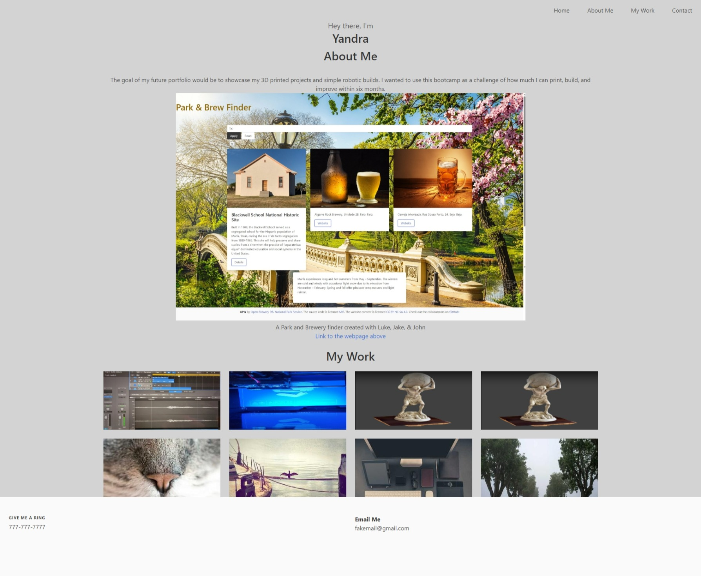

# Profile-Updated

After seeing how my peers used Bulma, they inspired me to try it for myself. 

[Click here for repo] (https://github.com/yankamb444/Profile-Updated) 
[Click here for live site] ()

[Click here to see the Bulma template used] (https://bulmatemplates.github.io/bulma-templates/templates/showcase.html)

##License 
Please refer to the license in the repositority 